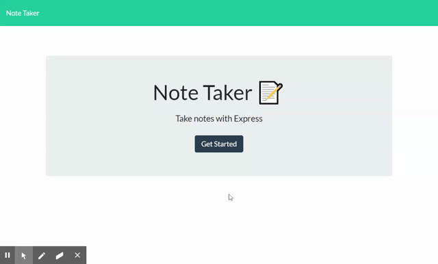

# Express - Note Taker


## Description
In this repository you will find an application that can be used to write, save and delete notes. This application uses an Express backend saves and retrieves notes from a JSON file.


## Table of Contents
* [Installation](#installation)
* [Usage](#usage)
* [Contributing](#contributing)
* [Questions](#questions)
* [License](#license)


## Installation
To use this application locally, the user must first open the terminal and install all dependencies by running the following command:

```bash
npm install
```


## Usage
A connection to the server can be established by running the following command:

```bash
node server.js
```



For a more seamless experience, users are encouraged to [run the application online.](https://limitless-thicket-48561.herokuapp.com/)

[Watch a video walkthrough of the application.](https://drive.google.com/file/d/1_EqJ_PaBRuHEMgnebBjcZ_sQcP0LrB23/view?usp=sharing)


## Contributing
* [Node.js](https://nodejs.org/en/)
* [Express](http://expressjs.com/)
* [uniqid](https://www.npmjs.com/package/uniqid)
* [npm](https://www.npmjs.com/)
* [Bootstrap](https://getbootstrap.com/)


## Questions
Find [jaccihorvath on GitHub](https://github.com/jaccihorvath) or email [jacci@gmail.com](mailto:jacci@gmail.com) with additional questions.


## License
Copyright (c) [jaccihorvath](https://github.com/jaccihorvath).
Licensed under the MIT License.